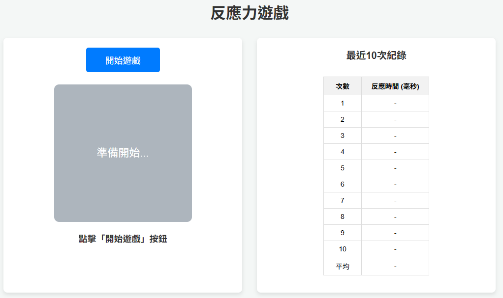

# ClickFast 🖱️⚡

ClickFast 是一个快节奏的点击游戏！在10秒内尽可能多地点击，赚取金币，购买升级，解锁成就！

## 目录

- [功能特色](#功能特色)
- [立即游玩](#立即游玩)
- [技术栈](#技术栈)
- [安装说明](#安装说明)
- [设置说明](#设置说明)
- [截图](#截图)
- [贡献](#贡献)
- [许可证](#许可证)

## 功能特色

- ⚡ **10秒点击挑战** - 在限定时间内尽可能多地点击
- 💰 **货币系统** - 每次点击获得金币，前10秒每次1金币，之后每次2金币
- 🛒 **商店系统** - 购买游戏时间延长、额外点击按钮、自动点击器
- 🎯 **多个点击按钮** - 购买额外按钮增加点击效率
- 🤖 **自动点击器** - 自动帮你点击，增加金币获取
- 🏆 **成就系统** - 完成各种挑战解锁成就并获得奖励
- 💾 **云端数据存储** - 所有数据保存在云端数据库
- 📱 **响应式设计** - 支持桌面和移动设备

## 立即游玩

- 👉 [ClickFast on Render](https://clickfast.onrender.com)
- 👉 [ClickFast on Vercel](https://click-fast.vercel.app/)

## 技术栈

- **后端**: Python (Django 5.1.7)
- **前端**: HTML5, CSS3, JavaScript (Vanilla)
- **数据库**: SQLite3 (可配置为PostgreSQL等云端数据库)
- **部署**: Render, Vercel

## 安装说明

```bash
# 克隆仓库
git clone https://github.com/Kaimin018/ClickFast.git
cd ClickFast

# 创建虚拟环境（推荐）
python -m venv myenv
source myenv/bin/activate  # Windows: myenv\Scripts\activate

# 安装依赖
pip install -r requirements.txt

# 运行数据库迁移
python manage.py migrate

# 初始化游戏数据（商店物品和成就）
python manage.py init_game_data

# 运行开发服务器
python manage.py runserver
```

## 设置说明

### 1. 数据库迁移

首次运行前需要创建数据库表：

```bash
python manage.py makemigrations
python manage.py migrate
```

### 2. 初始化游戏数据

运行管理命令初始化商店物品和成就：

```bash
python manage.py init_game_data
```

这将创建：
- 3种商店物品（游戏时间延长、额外点击按钮、自动点击器）
- 9个成就（总点击、单局点击、游戏局数等）

### 3. 创建超级用户（可选）

如果需要访问Django管理后台：

```bash
python manage.py createsuperuser
```

然后访问 `http://localhost:8000/admin/` 进行管理。

### 4. 创建超级测试账号（可选）

用于测试成就系统和商店物品功能：

```bash
python manage.py create_super_account
```

或者指定用户名和金币数量：

```bash
python manage.py create_super_account --username test_user --coins 2000000
```

超级账号将自动：
- 拥有大量金币（默认 1,000,000）
- 购买所有商店物品到最高等级
- 解锁所有成就
- 拥有高额的游戏统计数据

### 5. 云端数据库配置（可选）

如果需要使用云端数据库（如PostgreSQL），修改 `react_game/settings.py`：

```python
DATABASES = {
    'default': {
        'ENGINE': 'django.db.backends.postgresql',
        'NAME': os.getenv('DB_NAME'),
        'USER': os.getenv('DB_USER'),
        'PASSWORD': os.getenv('DB_PASSWORD'),
        'HOST': os.getenv('DB_HOST'),
        'PORT': os.getenv('DB_PORT', '5432'),
    }
}
```

## 游戏玩法

1. **登录/注册**: 输入用户名开始游戏
2. **点击挑战**: 点击"开始游戏"按钮，在10秒内尽可能多地点击
3. **赚取金币**: 每次点击获得金币（前10秒1金币/次，之后2金币/次）
4. **购买升级**: 在商店购买升级来提升游戏体验
5. **解锁成就**: 完成各种挑战解锁成就并获得奖励

## 商店物品

- **游戏时间延长**: 每次升级增加2秒游戏时间（最高10级）
- **额外点击按钮**: 每次升级增加1个点击按钮（最高5级）
- **自动点击器**: 每次升级增加1次/秒的自动点击（最高10级）

## 成就系统

- **总点击成就**: 累计点击100/1000/10000次
- **单局成就**: 单局点击50/100/200次
- **游戏局数成就**: 完成10/50/100局游戏

## 截图



## 贡献

欢迎贡献！请提交 issue 或 pull request。

## 许可证

本项目采用 MIT 许可证。